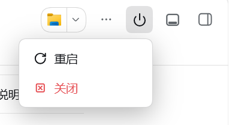

# dsh-restart-button

在 DeepSeek Harness（dsh）Web UI 的会话头部右侧工具区新增一个**关机按钮**，点击后展开「关闭 / 重启」两个操作，一键关闭或重启整个 DSH 进程。

> A power button in the DeepSeek Harness (dsh) Web UI session header. Click to expand a **Close / Restart** pair that shuts down or relaunches the whole DSH process.

## 特性

- 会话头部右侧工具区（工具栏）的关机图标按钮（⏻），悬浮高亮
- 点击展开菜单：「重启」「关闭」
  - **关闭**：先关闭当前网页，再关闭整个 DeepSeek Harness 进程
  - **重启**：先关闭当前网页，再由一个独立进程在 3 秒后重新启动同一个 DSH 命令
- 自包含重启：用 `process.execPath` + `process.argv` 重新拉起 DSH，**无需任何外部 `.bat` / `.sh` 脚本**（各平台支持情况见下方「兼容性」）
- 注册进 DSH 官方插槽 `conversation.session.header.utilities`，不改 DSH 核心；由 React 正常渲染，不依赖 DOM 结构猜测

## 安装

在终端执行：

```bash
dsh plugin --profile web add github:PangXitong/dsh-restart-button
```

然后重启 DSH，刷新页面，工具栏右侧即出现关机按钮。

## 使用

1. 点击工具栏右侧的关机按钮（⏻）→ 下方展开菜单
2. 点击「关闭」→ 当前网页关闭，随后 DSH 进程退出
3. 点击「重启」→ 当前网页关闭，3 秒后 DSH 进程重启，刷新页面即可继续使用

> 浏览器只允许脚本关闭「由脚本打开」的窗口，手动打开的标签页通常无法自动关闭。此时页面会转为整屏提示（「DSH 已关闭」/「DSH 正在重启…」），并提供「关闭此页面」按钮手动关闭。

## 截图


点击关机按钮展开菜单：



## 工作原理

插件采用 DSH 的「双半侧」结构：

| 半侧 | 文件 | 职责 |
| --- | --- | --- |
| Host（`lib/index.js`，Node 主进程） | `src/index.ts` | 通过 `ctx.inject(['webServer'])` 注册两条同源 HTTP 路由：`POST /dsh-restart-button/close`（`process.exit(0)`）与 `POST /dsh-restart-button/restart`（先创建重启用的独立进程，再退出） |
| Client（`lib/client.js`，浏览器） | `src/client/index.tsx` | 通过 `ctx.slots.inject('conversation.session.header.utilities', …)` 把关机按钮注册进会话头部右侧工具区（`kind: 'list'` 官方插槽）；点击按钮 `fetch` 同源路由，收到响应后关闭当前网页 |

### 关闭 / 重启的执行顺序

两个操作走同一套顺序 —— **先关网页，再关或重启 DSH**：

1. 客户端 `fetch` 调用对应的同源路由（`keepalive: true`，即使页面立刻关闭请求也能送达）
2. Host 回复 `{ ok: true }`
3. 客户端调用 `window.close()` 关闭当前页面
4. Host 随后才真正动作：**关闭**直接 `process.exit(0)`；**重启**则先创建好重启进程，再 `process.exit(0)`

重启进程在 Host 回复**之后**才被创建，因此页面一定先消失。

### 重启是如何做到的（`src/index.ts`）

关键点是：**从 DSH 进程里 `spawn(..., { detached: true })` 出来的子进程，在 Windows 上活不过父进程** —— 它仍在 DSH 的进程树 / 作业对象里，DSH 一退出就被一起杀掉（表现就是「只能关闭、不能重启」）。因此 Windows 上改为把重启交给 WMI 服务：

1. 在 `%TEMP%\dsh-restart-button-relaunch.ps1` 写一个 PowerShell 助手脚本：等待 3 秒 → 切回原工作目录 → 透传当前进程的环境变量 → 执行 `node <dsh bin.js> <原来的 argv>`
2. 通过 **WMI（`Win32_Process.Create`）** 创建这个助手进程 —— 它的父进程是 WMI 服务（`WmiPrvSE.exe`），**完全不在 DSH 的进程树里**，所以 DSH 退出后照常存活
3. 确认创建成功后，DSH 才 `process.exit(0)`

WMI 创建失败时会回退到 detached spawn 方式。

POSIX（macOS / Linux）走的是另一条路径：`sh -c 'sleep 3; exec …'` 配合 `detached: true`，理论依据是 `detached` 在 POSIX 上会调用 `setsid(2)` 建立新会话，配合 `stdio: 'ignore'` 可避免父进程退出时子进程收到 `SIGHUP`。**该路径尚未在真机上验证**，详见「兼容性」一节。

因为重新执行的是 `process.execPath` + `process.argv.slice(1)`（含 `--profile` 等参数），所以无论用 `dsh web`、`npx @deepseek-ai/dsh web` 还是 `node /path/to/dsh web` 启动，都能带同样的参数重启（在 Windows 上已实测；POSIX 上若通过符号链接启动，`process.argv[1]` 为软链路径，尚待验证）。

> 排查用日志：`%TEMP%\dsh-restart-button.log`（Windows）记录了每次重启的请求、助手进程 PID 与退出码。

### 客户端落位与关闭页面（`src/client/index.tsx`）

客户端用 DSH 官方的插槽机制落位，而不是猜测 DOM：`conversation.session.header.utilities` 是 ui-conversation 声明的 `kind: 'list'` 座位，和宿主自己的「Session log」胶囊同一行，按 `order` 插在流内，因此不会与宿主控件重叠。`slots.inject` 会等待该座位的声明出现（可能晚于本插件激活），声明被撤销后重新声明时会再次回调。React 由 DSH 客户端模块表作为平台基线模块提供，产物中只保留 `require('react')`，不打包第二份 React。

关闭页面用 `window.open('', '_self', '')` + `window.close()`。若浏览器拒绝关闭（手动打开的标签页会这样），400ms 后页面转为整屏提示，避免留下一个已断连的界面。

## 构建

源码用 TypeScript，`lib/` 预构建入库，安装时免构建。如需从源码重新构建：

```bash
pnpm install
pnpm run build        # node build.mjs，依赖 esbuild
```

产物：`lib/index.js`（ESM，Host）+ `lib/client.js`（`window.__ModuleLoader__.load` 格式，Client）。

## 兼容性

- DeepSeek Harness `0.1.5+`（开发该插件时的版本；会话头部工具插槽 `conversation.session.header.utilities` 需存在于 ui-conversation）
- Node.js `^22.19.0` 或 `>=24`

**平台支持情况：**

| 平台 | 关闭 | 重启 |
| --- | --- | --- |
| Windows | ✅ 已验证 | ✅ 已验证 |
| macOS | ✅（纯 Node API，无平台差异） | ⚠️ 未验证 |
| Linux | ✅（纯 Node API，无平台差异） | ⚠️ 未验证 |

**关闭**是纯 Node 的 `process.exit(0)`，无平台差异。

**重启**在 Windows 上已实测通过（见上节）；macOS / Linux 走的是另一条代码路径（`sh -c 'sleep 3; exec …'` + `detached: true`），该路径**尚未在真机上验证过**。理论上 `detached` 在 POSIX 上会调用 `setsid(2)` 建立新会话、配合 `stdio: 'ignore'` 可避免父进程退出时的 `SIGHUP`，但以下两点仍需实测确认：

- 孤儿进程在 macOS 的 `launchd` / Linux 各 init 系统下的存活行为
- 通过符号链接启动 DSH（如 `/usr/local/bin/dsh`）时，`process.argv[1]` 为软链路径，重启后能否正确定位入口文件

在 macOS / Linux 上使用前请先自行验证重启功能；关闭功能可直接使用。

> 该插槽属于 DSH 0.1.x 开发者预览版契约，破坏性更新后可能需要调整插槽名。插槽名在 `src/client/index.tsx` 的 `SLOT_HEADER_UTILITIES` 常量里；`src/client/react-shim.d.ts` 只是为了让本仓库在未安装 `@types/react` 时也能通过类型检查，若之后加入 `@types/react`，删掉该文件即可。

## 许可证

Apache-2.0
